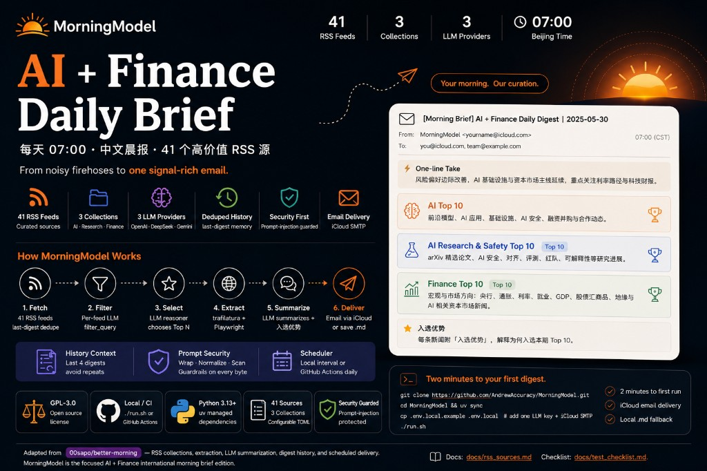

# MorningModel

<p align="center"><sub>Adapted from <a href="https://github.com/00sapo/better-morning"><b>better-morning</b></a> — configurable RSS collections, article extraction, LLM summarization, digest history, and scheduled delivery. MorningModel is the focused <b>AI + Finance international morning brief</b> edition.</sub></p>

<!--
  Banner — open docs/assets/morningmodel-banner.html in a browser
  for the live interactive version, then screenshot at 1400×560.
-->
<p align="center">
  <a href="docs/assets/morningmodel-banner.html">
    
  </a>
</p>

> **RSS is the firehose. Your inbox is the finish line.** MorningModel pulls high-signal RSS sources across AI industry, AI research & safety, and global finance — filters with LLM scoring, deduplicates across run history, and ships a ranked **Chinese morning email** every day. **41 curated feeds** across **3 collections** · **8 email providers** (Gmail · Outlook · QQ · iCloud · and more) · **3 LLM providers** (OpenAI · DeepSeek · Gemini via LiteLLM) · `last-digest` deduplication · prompt-injection guardrails · local `./run.sh` or **GitHub Actions at 07:00 Beijing time**.

<p align="center">
  <a href="LICENSE"></a>
  <a href="#rss-collections"></a>
  <a href="#rss-collections"></a>
  <a href="#llm-providers"></a>
  <a href="#quickstart"></a>
  <a href="#architecture"></a>
</p>

<p align="center">
  <a href="https://github.com/AndrewAccuracy/MorningModel/actions"></a>
  <a href="https://github.com/00sapo/better-morning"></a>
  <a href="#email-providers"></a>
  <a href="#six-load-bearing-ideas"></a>
</p>

<p align="center">
  <b>English</b> · <a href="README.zh-CN.md">简体中文</a> · <a href="docs/assets/morningmodel-banner.html">🎨 Banner HTML source</a> · <a href="docs/assets/morningmodel-email-preview.html">📧 Email template preview</a>
</p>

---

## What lands in your inbox

Every successful run produces four sections — three ranked Top 10 lists plus a single-sentence editor's take. Each selected item ends with **入选优势**, a short note on why it earned a slot.

The email uses a **newspaper layout** — serif typeface, masthead header, collapsed feed-report footnote. Open the live template:

> 👉 **[morningmodel-email-preview.html](docs/assets/morningmodel-email-preview.html)** — rendered from a real run on 2026-05-20

<details>
<summary><b>📄 Email HTML structure (click to expand)</b></summary>

```html
<!-- Masthead -->
<div class="masthead">
  <h1>AI + Finance 国际晨报</h1>
  <div class="dateline">Wednesday, May 20, 2026</div>
</div>

<!-- One-line Take (italic lede) -->
<div class="lede">
  <div class="lede-label">今日主线</div>
  <div class="lede-text">
    今天重点看 Google I/O 宣布搜索范式转变与全面 AI 代理化，
    同时全球债市抛售潮与中东能源冲击构成宏观对冲压力。
  </div>
</div>

<!-- One section per collection -->
<div class="section">
  <div class="section-title">AI Top 10</div>
  <div class="section-content">
    <!-- markdown2-rendered numbered list with Markdown links -->
    <ol>
      <li><strong>Google Search as you know it is over</strong>
        (<a href="…">TechCrunch AI</a>)
        Google在I/O大会上宣布…  入选优势：…
      </li>
      …
    </ol>
  </div>
</div>

<!-- Feed report — collapsed by default -->
<details>
  <summary>Feed 抓取报告</summary>
  <table>…</table>
</details>

<!-- Footer -->
<div class="footer">Better Morning · 每日 07:00 北京时间送达</div>
```

</details>

| Section | What it covers |
|---|---|
| **AI Top 10** | Frontier models, agents, open-source models, training/inference infrastructure, AI safety, AI policy, funding, M&A, and strategic partnerships. |
| **AI Research & Safety Top 10** | arXiv papers, AI safety, alignment, evaluations, red teaming, interpretability, and selected journal/community research. |
| **Finance Top 10** | FT/WSJ-style macro and market direction, central banks, inflation, rates, labor, GDP, equities, bonds, FX, commodities, geopolitics, and AI-related capital market news. |
| **One-line Take** | One compact sentence on the main thread, market risk appetite, and what deserves follow-up today. |

---

## Why this exists

International AI and finance news does not arrive in a neat stack — it arrives as **41 parallel RSS firehoses** (official blogs, arXiv, FT/WSJ, Fed/BIS, Medium tags, Substacks). Reading everything is impossible; reading nothing means missing the one story that moves your week.

MorningModel's bet is simple:

| Manual curation | MorningModel |
|---|---|
| Open 20 tabs every morning | One email at 07:00 Beijing time |
| Repeat the same story three days running | `last-digest` history dedupes across runs |
| Summarize in your head | LLM writes Chinese summaries with **入选优势** |
| Hope RSS titles are enough | Playwright + trafilatura fetch full article bodies when needed |
| Trust every newsletter's tone | Per-feed `filter_query` + prompt-injection guardrails |

**The digest is the product.** When the pipeline finishes, the artifact is what your audience (you) actually reads — not a draft folder of links.

We stand on one open-source shoulder:

- [**`00sapo/better-morning`**](https://github.com/00sapo/better-morning) — the configurable RSS collection system, article extraction pipeline, LLM summarization flow, history handling, email output, and GitHub Actions structure. MorningModel extends it with AI + Finance source packs, Chinese editorial prompts, security hardening, and scheduled local runs.

---

## At a glance

| | What you get |
|---|---|
| **3 collections** | `AI Top 10` · `AI Research & Safety Top 10` · `Finance Top 10` — each with its own `collection_prompt`, filter rules, and feed list. |
| **41 RSS feeds** | Official AI blogs, arXiv queries, FT/WSJ/CNBC, Fed/BIS press releases, Medium tags, and selected Substacks — see [`docs/rss_sources.md`](docs/rss_sources.md). |
| **3 LLM providers** | OpenAI · DeepSeek · Gemini through LiteLLM — fill one API key, set `BETTER_MORNING_LLM_PROVIDER=auto`, or pin a provider when multiple keys exist. |
| **Dedup & context** | `max_age = "last-digest"` per collection; last 4 digests fed back as LLM context so the model avoids repeating old stories. |
| **Full-article extraction** | `trafilatura` + Playwright for pages RSS summaries cannot carry; paywalled FT/WSJ titles still signal, accessible sources fill detail. |
| **Chinese output** | Summaries, section intros, and **入选优势** lines are Chinese by default (`output_language = "Chinese"` in `config.toml`). |
| **Email delivery** | iCloud SMTP (`smtp.mail.me.com:587`) — HTML email rendered from markdown via `markdown2`. |
| **Local fallback** | Missing SMTP credentials → `daily-digest-YYYY-MM-DD.md` written locally. |
| **Automation** | `./run.sh` locally · `./run.sh --scheduled` with interval guard · GitHub Actions cron `0 23 * * *` UTC (07:00 Beijing). |
| **Security** | Untrusted RSS/web/PDF content wrapped, normalized, and scanned before every LLM call — see [`src/better_morning/prompt_security.py`](src/better_morning/prompt_security.py). |
| **License** | GPL-3.0 (inherited from upstream) |

---

## Quickstart

```bash
git clone https://github.com/AndrewAccuracy/MorningModel.git
cd MorningModel
pip install uv
uv sync
uv run playwright install --with-deps   # first run only
cp .env.local.example .env.local
# edit .env.local — one LLM key + iCloud SMTP credentials
./run.sh
```

**Two minutes to first digest.** Fill one provider key in `.env.local`, set iCloud SMTP (app-specific password), and run. `.env.local` is git-ignored — never commit API keys or passwords.

If email credentials are missing or delivery fails, the run still saves:

```text
daily-digest-YYYY-MM-DD.md
```

---

## LLM providers

MorningModel uses [LiteLLM](https://github.com/BerriAI/litellm) model names. Fill **one** key in `.env.local`:

```bash
BETTER_MORNING_OPENAI_API_KEY=""
BETTER_MORNING_DEEPSEEK_API_KEY=""
BETTER_MORNING_GEMINI_API_KEY=""
BETTER_MORNING_LLM_PROVIDER="auto"   # auto | openai | deepseek | gemini
```

If more than one key is set, pin the provider:

```bash
BETTER_MORNING_LLM_PROVIDER="openai"
```

Default model profiles:

| Provider | Reasoner (selection + overview) | Light (per-article summary) | Filter |
| --- | --- | --- | --- |
| **OpenAI** | `openai/gpt-4o` | `openai/gpt-4o-mini` | `openai/gpt-4o` |
| **DeepSeek** | `deepseek/deepseek-reasoner` | `deepseek/deepseek-chat` | `deepseek/deepseek-chat` |
| **Gemini** | `gemini/gemini-2.5-pro` | `gemini/gemini-2.5-flash` | `gemini/gemini-2.5-flash` |

Override any slot:

```bash
BETTER_MORNING_REASONER_MODEL=""
BETTER_MORNING_LIGHT_MODEL=""
BETTER_MORNING_FILTER_MODEL=""
```

Leave empty to keep provider defaults.

---

## Email setup

Default transport is iCloud Mail (`config.toml`):

```toml
[output_settings]
output_type = "email"
smtp_server = "smtp.mail.me.com"
smtp_port = 587
```

Secrets in `.env.local`:

```bash
BETTER_MORNING_SMTP_USERNAME="yourname@icloud.com"      # also the visible sender
BETTER_MORNING_SMTP_PASSWORD="your-icloud-app-password" # Apple app-specific password
BETTER_MORNING_RECIPIENT_EMAIL="you@icloud.com,other@example.com"
```

Use commas, semicolons, or newlines for multiple recipients.

---

## RSS collections

Active collection files — **adding a feed is one `[[feeds]]` block**:

| Collection | File | Feeds | Focus |
|---|---|---:|---|
| **AI Top 10** | [`collections/ai_news.toml`](collections/ai_news.toml) | 13 | Industry news — OpenAI, DeepMind, TechCrunch AI, Latent Space, … |
| **AI Research & Safety Top 10** | [`collections/ai_research_safety.toml`](collections/ai_research_safety.toml) | 12 | arXiv CS.AI/LG, JMLR, Alignment Forum, AI Snake Oil, … |
| **Finance Top 10** | [`collections/finance_news.toml`](collections/finance_news.toml) | 16 | FT, WSJ, CNBC, Fed, BIS, Apricitas, Net Interest, … |

Each collection sets:

```toml
max_age = "last-digest"
```

After a successful run, timestamps land under `history/`, so the next run skips articles already covered.

Add a source:

```toml
[[feeds]]
url = "https://example.com/rss.xml"
name = "Example Source"
max_articles = 20
# filter_query = "..."   # optional per-feed LLM boolean filter
```

Full source list and tuning notes → [`docs/rss_sources.md`](docs/rss_sources.md).

Medium tags and newsletters are high-discovery but noisy — keep `max_articles` modest and use strict `filter_query` rules where needed.

---

## Six load-bearing ideas

### 1 · Collections are TOML files, not code.

Drop a new `collections/*.toml`, set `name`, `collection_prompt`, `n_most_important_news`, and `[[feeds]]` blocks. `src/main.py` globs every collection on each run. No redeploy beyond restarting the process.

### 2 · Fetch cheap, extract expensive.

RSS titles and summaries arrive first. The reasoner model **selects** which articles deserve a full fetch; only those go through Playwright/trafilatura. When per-feed `filter_query` is enabled, boolean filtering runs before selection — shrinking the LLM surface on noisy Medium tags.

### 3 · History is editorial memory.

`history/*_digest_history.json` and `history/digest_history.json` store what you already shipped. The last **4** digests are injected as LLM context (`context_digest_size` in `config.toml`) so today's Top 10 does not repeat yesterday's front page.

### 4 · 入选优势 is the ranking explained.

Every surviving item gets a one-line **入选优势** — why it beat the other candidates. That line is prompt-enforced in both per-article summaries and the collection overview pass, so the final email reads like an editor's desk, not a link dump.

### 5 · Untrusted input stays untrusted.

RSS bodies, scraped HTML, PDFs, and previous digest text are wrapped in `BEGIN_UNTRUSTED_CONTENT` markers, normalized (control chars, zero-width glyphs), and scanned for injection patterns before any model call. A system prompt tells the model to treat article text as data only. This reduces risk; curated sources and secret hygiene still matter.

### 6 · Same pipeline, three schedulers.

| Mode | Command | When it runs |
|---|---|---|
| **Manual** | `./run.sh` | Whenever you invoke it |
| **Local interval** | `./run.sh --scheduled` | Only when `last_success_at + BETTER_MORNING_RUN_INTERVAL_DAYS` (default **5**) has elapsed |
| **GitHub Actions** | `workflow_dispatch` or cron `0 23 * * *` UTC | Daily cloud run with `history/` cache restore/save |

`./run.sh --scheduled` is a lightweight guard — macOS LaunchAgents can call it every 12h (`StartInterval = 43200`); the heavy digest still fires only when the interval is due. Prefer `~/Code/better-morning` over `Desktop`/`Documents` for LaunchAgent paths (TCC privacy).

---

## Architecture

```
┌─────────────────────── run.sh / GitHub Actions ───────────────────────┐
│  load .env.local secrets · uv sync · playwright browsers (CI only)   │
└───────────────────────────────┬───────────────────────────────────────┘
                                │
                                ▼
                    ┌───────────────────────┐
                    │  src/main.py          │
                    │  glob collections/*.toml │
                    └───────────┬───────────┘
                                │ per collection (parallel asyncio)
        ┌───────────────────────┼───────────────────────┐
        ▼                       ▼                       ▼
 ┌─────────────┐        ┌──────────────┐        ┌─────────────────┐
 │ RSSFetcher  │        │ LLMSummarizer│        │ ContentExtractor│
 │ feedparser  │───────►│ LiteLLM      │◄───────│ trafilatura +   │
 │ last-digest │ select │ select · sum │ fetch  │ Playwright      │
 │ dedupe      │        │ overview     │        │                 │
 └─────────────┘        └──────┬───────┘        └─────────────────┘
                               │ prompt_security wraps untrusted text
                               ▼
                    ┌───────────────────────┐
                    │  DocumentGenerator    │
                    │  markdown digest +    │
                    │  One-line Take        │
                    └───────────┬───────────┘
                                │
              ┌─────────────────┴─────────────────┐
              ▼                                   ▼
     ┌─────────────────┐               ┌──────────────────┐
     │  iCloud SMTP    │               │  daily-digest-   │
     │  HTML email     │               │  YYYY-MM-DD.md   │
     └─────────────────┘               └──────────────────┘
                                │
                                ▼
                    history/*.json  (articles + digests + scheduler)
```

| Layer | Stack |
|---|---|
| Runtime | Python 3.13+ · `uv` for deps ([`pyproject.toml`](pyproject.toml)) |
| RSS | `feedparser` · per-collection `[[feeds]]` in TOML |
| Extraction | `trafilatura` · `playwright` (headless fetch when needed) |
| LLM | `litellm` — reasoner / light / filter model roles |
| Security | [`prompt_security.py`](src/better_morning/prompt_security.py) — wrap, normalize, injection heuristics |
| Output | `markdown2` → HTML email · local `.md` fallback |
| Config | [`config.toml`](config.toml) (global prompts) + `collections/*.toml` (feeds + filters) |
| CI | [`.github/workflows/daily_digest.yml`](.github/workflows/daily_digest.yml) · `history/` cache between runs |
| Tests | `pytest` under [`tests/`](tests/) |

---

## Output

| Target | When | Notes |
|---|---|---|
| **iCloud email** | `output_type = "email"` and SMTP secrets set | Subject: `[Morning Brief] AI + Finance Daily Digest \| YYYY-MM-DD` |
| **Local markdown** | SMTP missing or send fails | `daily-digest-YYYY-MM-DD.md` in repo root |
| **History JSON** | Every successful run | `history/` — powers dedupe and LLM context |

---

## Local automation

```bash
./run.sh                              # run now, clear logs (default)
BETTER_MORNING_CLEAR_LOGS_ON_RUN=0 ./run.sh   # keep run.log for debugging
./run.sh --scheduled                  # respect BETTER_MORNING_RUN_INTERVAL_DAYS (default 5)
BETTER_MORNING_RUN_INTERVAL_DAYS=1 ./run.sh --scheduled
```

Each normal run also prunes local data older than 90 days via [`scripts/cleanup_old_data.py`](scripts/cleanup_old_data.py).

**macOS LaunchAgent pattern:** `RunAtLoad = true` + `StartInterval = 43200` → call `./run.sh --scheduled` from a non-TCC-protected path like `~/Code/better-morning`.

---

## GitHub Actions

[`.github/workflows/daily_digest.yml`](.github/workflows/daily_digest.yml):

- **Manual:** `workflow_dispatch`
- **Scheduled:** `0 23 * * *` UTC = **07:00 Beijing time**

Repository secrets:

| Secret | Required |
|---|---|
| One of `BETTER_MORNING_OPENAI_API_KEY` / `DEEPSEEK` / `GEMINI` | ✅ |
| `BETTER_MORNING_LLM_PROVIDER` | Only if multiple keys set |
| `BETTER_MORNING_SMTP_USERNAME` | ✅ for email |
| `BETTER_MORNING_SMTP_PASSWORD` | ✅ for email |
| `BETTER_MORNING_RECIPIENT_EMAIL` | ✅ for email |

`history/` is restored/saved via Actions cache between runs so dedupe survives across days.

---

## Roadmap

- [ ] **Telegram / Slack delivery** — second output channel beside email
- [ ] **Per-recipient collection toggles** — subscribe to AI-only or Finance-only
- [ ] **Web preview UI** — read today's digest in browser before send
- [ ] **Source health dashboard** — feed failure rates and auto-disable noisy feeds
- [ ] **Multi-language output** — English digest variant beside Chinese

---

## Status

Early but real. The closed loop — **fetch RSS → select → extract → summarize → dedupe-aware overview → email** — runs end-to-end locally and on GitHub Actions. Source packs and security guardrails are the highest-leverage knobs; prompt tuning ships iteratively.

| Surface | State |
|---|---|
| 3 collections · 41 feeds | ✅ stable |
| LiteLLM multi-provider | ✅ stable |
| `last-digest` dedupe + history context | ✅ stable |
| Full-article extraction (trafilatura + Playwright) | ✅ stable |
| Prompt-injection guardrails | ✅ stable |
| iCloud SMTP + `.md` fallback | ✅ stable |
| `./run.sh --scheduled` interval guard | ✅ stable |
| GitHub Actions daily cron + history cache | ✅ stable |
| Telegram / Slack output | ⏳ planned |
| Web preview UI | ⏳ planned |

---

## Contributing

Issues, PRs, new feeds, tighter `filter_query` rules, and prompt improvements are welcome. Highest-leverage shapes:

- **Add a feed** — one `[[feeds]]` block in the right `collections/*.toml`; document it in [`docs/rss_sources.md`](docs/rss_sources.md).
- **Tune a collection** — edit `collection_prompt`, `filter_query`, or `n_most_important_news` in the collection file.
- **Harden security** — extend [`prompt_security.py`](src/better_morning/prompt_security.py) patterns or tests in [`tests/`](tests/).
- **Fix extraction** — [`content_extractor.py`](src/better_morning/content_extractor.py) for sites that break trafilatura/Playwright.

Run tests before opening a PR:

```bash
uv run pytest
```

Operational checklist → [`docs/test_checklist.md`](docs/test_checklist.md).

---

## Project layout

| Path | Role |
|---|---|
| [`config.toml`](config.toml) | Global LLM prompts, output settings, context window size |
| [`collections/*.toml`](collections/) | Per-column feeds, filters, and editorial prompts |
| [`src/better_morning/`](src/better_morning/) | RSS fetch, extract, summarize, generate, secure |
| [`src/main.py`](src/main.py) | Orchestrates all collections per run |
| [`run.sh`](run.sh) | Local entry — env load, cleanup, `run_local.py` |
| [`scripts/run_if_due.py`](scripts/run_if_due.py) | Scheduled interval guard |
| [`history/`](history/) | Article timestamps, digest archive, scheduler state |
| [`docs/rss_sources.md`](docs/rss_sources.md) | Human-readable source catalog |
| [`docs/assets/morningmodel-banner.html`](docs/assets/morningmodel-banner.html) | HTML design source for the GitHub banner |
| [`docs/assets/morningmodel-email-preview.png`](docs/assets/morningmodel-email-preview.png) | Real email output preview used in the README |

---

## References & lineage

| Project | Role here |
|---|---|
| [**`00sapo/better-morning`**](https://github.com/00sapo/better-morning) | Upstream architecture — RSS collections, extraction, LLM flow, email output, Actions workflow. |
| [**`BerriAI/litellm`**](https://github.com/BerriAI/litellm) | Unified OpenAI / DeepSeek / Gemini routing. |
| [**`adbar/trafilatura`**](https://github.com/adbar/trafilatura) | Primary article body extraction. |
| [**`microsoft/playwright`**](https://github.com/microsoft/playwright) | Headless fetch when RSS content is insufficient. |

---

## License

GPL-3.0 — inherited from [`00sapo/better-morning`](https://github.com/00sapo/better-morning). See [`LICENSE`](LICENSE).
