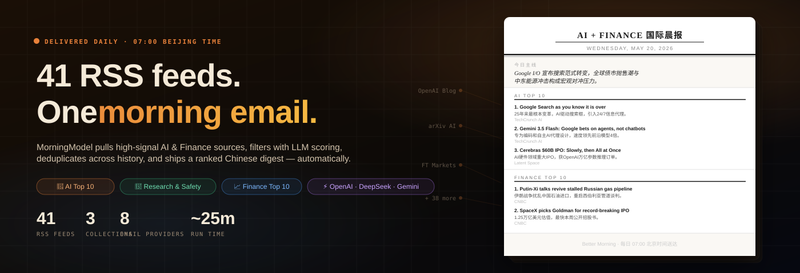

# MorningModel

<p align="center"><sub>基于 <a href="https://github.com/00sapo/better-morning"><b>better-morning</b></a> 改造：保留可配置 RSS collection、正文抽取、LLM 摘要、历史记录和定时投递能力；MorningModel 是面向 <b>AI + Finance 国际晨报</b> 的专门版本。</sub></p>

<p align="center">
  <a href="docs/assets/morningmodel-banner.html">
    
  </a>
</p>

> **RSS 是信息洪流，收件箱才是终点。** MorningModel 会从 AI 产业、AI 研究与安全、全球金融市场的高信号 RSS 源中抓取内容，用 LLM 评分过滤，跨历史去重，并发送排序后的 **中文晨报**。**41 个精选信息源** · **3 个栏目** · **8 个邮件提供商**（Gmail · Outlook · QQ · iCloud 等）· **3 个 LLM 提供商**（OpenAI · DeepSeek · Gemini via LiteLLM）· `last-digest` 去重 · prompt-injection 防护 · 本地 `./run.sh` 或 **GitHub Actions 每天北京时间 07:00** 自动运行。

<p align="center">
  <a href="LICENSE"></a>
  <a href="#rss-collections"></a>
  <a href="#rss-collections"></a>
  <a href="#llm-providers"></a>
  <a href="#quickstart"></a>
  <a href="#architecture"></a>
</p>

<p align="center">
  <b>简体中文</b> · <a href="README.md">English</a> · <a href="docs/assets/morningmodel-banner.html">🎨 Banner HTML 设计稿</a> · <a href="docs/assets/morningmodel-email-preview.html">📧 邮件模板预览</a>
</p>

---

## 你会收到什么

每次成功运行后，邮件里会有四个部分——三个排序后的 Top 10 栏目和一句编辑式总览。每条入选新闻都会带上 **入选优势**，解释它为什么比普通候选更值得占位。

邮件采用**报纸排版**——衬线字体、报头、可折叠的抓取报告。打开实时模板：

> 👉 **[morningmodel-email-preview.html](docs/assets/morningmodel-email-preview.html)** — 来自 2026-05-20 真实运行结果

<details>
<summary><b>📄 邮件 HTML 结构（点击展开）</b></summary>

```html
<!-- 报头 -->
<div class="masthead">
  <h1>AI + Finance 国际晨报</h1>
  <div class="dateline">Wednesday, May 20, 2026</div>
</div>

<!-- 今日主线（斜体导语） -->
<div class="lede">
  <div class="lede-label">今日主线</div>
  <div class="lede-text">
    今天重点看 Google I/O 宣布搜索范式转变与全面 AI 代理化，
    同时全球债市抛售潮与中东能源冲击构成宏观对冲压力。
  </div>
</div>

<!-- 每个 collection 对应一个 section -->
<div class="section">
  <div class="section-title">AI Top 10</div>
  <div class="section-content">
    <!-- markdown2 渲染的编号列表，含 Markdown 链接 -->
    <ol>
      <li><strong>Google Search as you know it is over</strong>
        (<a href="…">TechCrunch AI</a>)
        Google 在 I/O 大会上宣布…  入选优势：…
      </li>
      …
    </ol>
  </div>
</div>

<!-- 抓取报告——默认折叠 -->
<details>
  <summary>Feed 抓取报告</summary>
  <table>…</table>
</details>

<!-- 页脚 -->
<div class="footer">Better Morning · 每日 07:00 北京时间送达</div>
```

</details>

| 栏目 | 覆盖范围 |
|---|---|
| **AI Top 10** | 前沿模型、Agent、开源模型、训练/推理基础设施、AI 安全、AI 政策、融资、并购和战略合作。 |
| **AI Research & Safety Top 10** | arXiv 论文、AI safety、alignment、评测、red teaming、可解释性，以及精选研究社区内容。 |
| **Finance Top 10** | FT/WSJ 风格的全球宏观与市场方向、央行、通胀、利率、就业、GDP、股债汇商品、地缘政治，以及 AI 相关资本市场新闻。 |
| **One-line Take** | 一句话概括今天的主线、风险偏好和最值得继续跟踪的变化。 |

---

## 为什么做这个

AI 和金融新闻不会整理好再走到你面前，它们通常分散在官方博客、arXiv、FT/WSJ、Fed/BIS、Medium 标签、Substack 和各种 newsletter 里。全部读完不现实，但完全不读又会错过真正改变判断的那一条。

MorningModel 的目标很简单：

| 手工看新闻 | MorningModel |
|---|---|
| 早上打开 20 个标签页 | 每天北京时间 07:00 收一封邮件 |
| 同一条旧新闻反复出现 | `last-digest` 历史去重 |
| 自己在脑子里归纳 | LLM 生成中文摘要和 **入选优势** |
| 只靠 RSS 标题判断 | Playwright + trafilatura 抽取正文 |
| 信任每个网页里的文本 | per-feed `filter_query` + prompt-injection 防护 |

**晨报本身就是产品。** 流水线结束后，你拿到的是可以直接阅读和转发的成品，不是一堆待处理链接。

---

## At a glance

| | 你得到什么 |
|---|---|
| **3 个栏目** | `AI Top 10` · `AI Research & Safety Top 10` · `Finance Top 10`，每个栏目都有独立提示词、过滤规则和信息源。 |
| **41 个 RSS 源** | 官方 AI 博客、arXiv 查询、FT/WSJ/CNBC、Fed/BIS 新闻稿、Medium 标签、精选 Substack；完整列表见 [`docs/rss_sources.md`](docs/rss_sources.md)。 |
| **3 个 LLM 提供商** | 通过 LiteLLM 支持 OpenAI、DeepSeek、Gemini；填一个 API key 即可，多个 key 时可指定 provider。 |
| **去重与上下文** | 每个 collection 使用 `max_age = "last-digest"`；最近 4 期晨报会作为上下文，帮助模型避免重复旧故事。 |
| **正文抽取** | `trafilatura` + Playwright 处理 RSS 摘要装不下的正文；FT/WSJ 的公开标题仍可作为高信号线索。 |
| **中文输出** | `config.toml` 默认 `output_language = "Chinese"`，摘要、栏目和 **入选优势** 都以中文生成。 |
| **邮件投递** | iCloud SMTP (`smtp.mail.me.com:587`)，Markdown 经 `markdown2` 渲染为 HTML 邮件。 |
| **本地回退** | SMTP 凭据缺失或发送失败时，保存 `daily-digest-YYYY-MM-DD.md`。 |
| **自动化** | 本地 `./run.sh` · 带间隔保护的 `./run.sh --scheduled` · GitHub Actions 每天 23:00 UTC 运行。 |
| **安全防护** | RSS、网页、PDF、历史摘要都按不可信输入处理；见 [`src/better_morning/prompt_security.py`](src/better_morning/prompt_security.py)。 |
| **License** | GPL-3.0（继承自上游） |

---

## Quickstart

```bash
git clone https://github.com/AndrewAccuracy/MorningModel.git
cd MorningModel
pip install uv
uv sync
uv run playwright install --with-deps   # 首次运行需要
cp .env.local.example .env.local
# 编辑 .env.local：填一个 LLM key + iCloud SMTP 凭据
./run.sh
```

`.env.local` 已被 git 忽略。不要提交 API key、iCloud app-specific password 或收件人地址。

如果邮件配置缺失或投递失败，本地仍会生成：

```text
daily-digest-YYYY-MM-DD.md
```

---

## LLM providers

MorningModel 使用 [LiteLLM](https://github.com/BerriAI/litellm) 模型名。先在 `.env.local` 填 **一个** provider key：

```bash
BETTER_MORNING_OPENAI_API_KEY=""
BETTER_MORNING_DEEPSEEK_API_KEY=""
BETTER_MORNING_GEMINI_API_KEY=""
BETTER_MORNING_LLM_PROVIDER="auto"   # auto | openai | deepseek | gemini
```

如果配置了多个 key，请指定 provider：

```bash
BETTER_MORNING_LLM_PROVIDER="openai"
```

默认模型配置：

| Provider | Reasoner（选择 + 总览） | Light（单篇摘要） | Filter |
| --- | --- | --- | --- |
| **OpenAI** | `openai/gpt-4o` | `openai/gpt-4o-mini` | `openai/gpt-4o` |
| **DeepSeek** | `deepseek/deepseek-reasoner` | `deepseek/deepseek-chat` | `deepseek/deepseek-chat` |
| **Gemini** | `gemini/gemini-2.5-pro` | `gemini/gemini-2.5-flash` | `gemini/gemini-2.5-flash` |

如需手动覆盖：

```bash
BETTER_MORNING_REASONER_MODEL=""
BETTER_MORNING_LIGHT_MODEL=""
BETTER_MORNING_FILTER_MODEL=""
```

留空则使用 provider 默认值。

---

## Email setup

默认邮件通道是 iCloud Mail：

```toml
[output_settings]
output_type = "email"
smtp_server = "smtp.mail.me.com"
smtp_port = 587
```

`.env.local` 中配置：

```bash
BETTER_MORNING_SMTP_USERNAME="yourname@icloud.com"
BETTER_MORNING_SMTP_PASSWORD="your-icloud-app-specific-password"
BETTER_MORNING_RECIPIENT_EMAIL="yourname@icloud.com,another@example.com"
```

`BETTER_MORNING_SMTP_USERNAME` 既是 SMTP 登录账号，也是邮件发件人。iCloud 必须使用 Apple app-specific password，不要用 Apple ID 密码。多个收件人可用逗号、分号或换行分隔。

---

## RSS collections

当前启用的 collection：

| Collection | File | Feeds | Focus |
|---|---|---:|---|
| **AI Top 10** | [`collections/ai_news.toml`](collections/ai_news.toml) | 13 | AI 产业新闻：OpenAI、DeepMind、TechCrunch AI、Latent Space 等。 |
| **AI Research & Safety Top 10** | [`collections/ai_research_safety.toml`](collections/ai_research_safety.toml) | 12 | arXiv CS.AI/LG、JMLR、Alignment Forum、AI Snake Oil 等。 |
| **Finance Top 10** | [`collections/finance_news.toml`](collections/finance_news.toml) | 16 | FT、WSJ、CNBC、Fed、BIS、Apricitas、Net Interest 等。 |

每个 collection 都使用：

```toml
max_age = "last-digest"
```

成功运行后，时间戳和摘要历史会写入 `history/`，后续运行会跳过已经覆盖过的旧文章。

添加信息源只需要一个 `[[feeds]]` block：

```toml
[[feeds]]
url = "https://example.com/rss.xml"
name = "Example Source"
max_articles = 20
# filter_query = "..."   # 可选：针对该 feed 的 LLM 布尔过滤
```

完整源列表和调优建议见 [`docs/rss_sources.md`](docs/rss_sources.md)。

---

## 六个关键设计

### 1. Collection 是 TOML，不是代码

新增或调整栏目主要改 `collections/*.toml`：`name`、`collection_prompt`、`n_most_important_news` 和 `[[feeds]]`。`src/main.py` 每次运行都会读取所有 collection。

### 2. 先低成本筛选，再高成本抽取

系统先抓 RSS 标题和摘要，由 reasoner model 选择值得抽取正文的文章；只有入选候选才进入 Playwright/trafilatura。对噪声大的 feed，可先用 `filter_query` 做布尔过滤。

### 3. History 是编辑记忆

`history/*_digest_history.json` 和 `history/digest_history.json` 保存已经发过的内容。最近 4 期会作为 LLM 上下文，降低重复报道。

### 4. 入选优势是排序解释

每条新闻都必须说明 **入选优势**。这让邮件不像链接堆，而更像编辑部筛过的一版晨报。

### 5. 外部内容始终不可信

RSS、网页、PDF、newsletter 和历史摘要都会被包进 `BEGIN_UNTRUSTED_CONTENT` 标记，清理控制字符和零宽字符，并扫描常见 prompt-injection 模式。防护不能替代源头筛选，但能显著降低风险。

### 6. 同一条流水线，三种运行方式

| 模式 | 命令 | 说明 |
|---|---|---|
| **手动运行** | `./run.sh` | 立即生成一次晨报 |
| **本地定时** | `./run.sh --scheduled` | 只有达到 `BETTER_MORNING_RUN_INTERVAL_DAYS`（默认 5 天）才真正运行 |
| **GitHub Actions** | `workflow_dispatch` 或 cron `0 23 * * *` UTC | 云端每日运行，并缓存 `history/` |

macOS LaunchAgent 推荐频繁轻量检查，而不是设置一个很长的一次性 timer。例如每 12 小时执行 `./run.sh --scheduled`，真正的重活由脚本判断是否到期。

---

## Architecture

```text
┌─────────────────────── run.sh / GitHub Actions ───────────────────────┐
│  加载 .env.local secrets · uv sync · 安装 Playwright 浏览器（CI）       │
└───────────────────────────────┬───────────────────────────────────────┘
                                ▼
                    ┌───────────────────────┐
                    │  src/main.py          │
                    │  读取 collections/*.toml │
                    └───────────┬───────────┘
                                │ 每个 collection 并发处理
        ┌───────────────────────┼───────────────────────┐
        ▼                       ▼                       ▼
 ┌─────────────┐        ┌──────────────┐        ┌─────────────────┐
 │ RSSFetcher  │        │ LLMSummarizer│        │ ContentExtractor│
 │ feedparser  │───────►│ LiteLLM      │◄───────│ trafilatura +   │
 │ last-digest │ select │ select · sum │ fetch  │ Playwright      │
 │ 去重        │        │ overview     │        │                 │
 └─────────────┘        └──────┬───────┘        └─────────────────┘
                               │ prompt_security 包装不可信文本
                               ▼
                    ┌───────────────────────┐
                    │  DocumentGenerator    │
                    │  markdown digest +    │
                    │  One-line Take        │
                    └───────────┬───────────┘
                                │
              ┌─────────────────┴─────────────────┐
              ▼                                   ▼
     ┌─────────────────┐               ┌──────────────────┐
     │  iCloud SMTP    │               │  daily-digest-   │
     │  HTML email     │               │  YYYY-MM-DD.md   │
     └─────────────────┘               └──────────────────┘
                                │
                                ▼
                    history/*.json  (articles + digests + scheduler)
```

| Layer | Stack |
|---|---|
| Runtime | Python 3.13+ · `uv` |
| RSS | `feedparser` · TOML collection |
| Extraction | `trafilatura` · Playwright |
| LLM | `litellm` · reasoner / light / filter 三类模型角色 |
| Security | [`prompt_security.py`](src/better_morning/prompt_security.py) — 包装、归一化、注入启发式检测 |
| Output | `markdown2` → HTML email · 本地 `.md` 回退 |
| Config | [`config.toml`](config.toml)（全局提示词）+ `collections/*.toml`（feeds + 过滤器） |
| CI | [`.github/workflows/daily_digest.yml`](.github/workflows/daily_digest.yml) |
| Tests | `pytest` under [`tests/`](tests/) |

---

## Output

| Target | 触发条件 | 说明 |
|---|---|---|
| **iCloud email** | `output_type = "email"` 且 SMTP secrets 完整 | Subject: `[Morning Brief] AI + Finance Daily Digest \| YYYY-MM-DD` |
| **Local markdown** | SMTP 缺失或发送失败 | `daily-digest-YYYY-MM-DD.md` |
| **History JSON** | 成功运行后 | `history/`，用于去重和上下文 |

---

## Local automation

```bash
./run.sh
BETTER_MORNING_CLEAR_LOGS_ON_RUN=0 ./run.sh
./run.sh --scheduled
BETTER_MORNING_RUN_INTERVAL_DAYS=1 ./run.sh --scheduled
```

每次正常运行都会通过 [`scripts/cleanup_old_data.py`](scripts/cleanup_old_data.py) 清理 90 天以前的本地数据。

macOS 上建议把自动化目录放在 `~/Code/better-morning` 或 `~/.local/share/better-morning`，避免 `Desktop` / `Documents` 的系统隐私权限问题。

---

## GitHub Actions

[`.github/workflows/daily_digest.yml`](.github/workflows/daily_digest.yml) 支持：

- 手动运行：`workflow_dispatch`
- 定时运行：`0 23 * * *` UTC，即北京时间 07:00

推荐配置的 repository secrets：

| Secret | 是否必需 |
|---|---|
| `BETTER_MORNING_OPENAI_API_KEY` / `DEEPSEEK` / `GEMINI` 三选一 | 是 |
| `BETTER_MORNING_LLM_PROVIDER` | 多个 key 时需要 |
| `BETTER_MORNING_SMTP_USERNAME` | 邮件投递需要 |
| `BETTER_MORNING_SMTP_PASSWORD` | 邮件投递需要 |
| `BETTER_MORNING_RECIPIENT_EMAIL` | 邮件投递需要 |

GitHub Actions 会缓存 `history/`，让跨天去重继续生效。

---

## Roadmap

- [ ] **Telegram / Slack 投递**：邮件之外的第二输出通道
- [ ] **按收件人订阅栏目**：只收 AI、只收 Finance 或全量
- [ ] **Web preview UI**：发送前在浏览器中预览今天晨报
- [ ] **Source health dashboard**：统计 feed 失败率和噪声情况
- [ ] **多语言输出**：中文之外生成英文晨报

---

## Status

当前闭环已经可用：**抓取 RSS → 候选选择 → 正文抽取 → 摘要 → 带历史记忆的总览 → 邮件发送**。信息源、prompt 和安全规则是最主要的调优杠杆。

| Surface | State |
|---|---|
| 3 个 collection · 41 个 feed | ✅ 稳定 |
| LiteLLM 多 provider | ✅ 稳定 |
| `last-digest` 去重 + 历史上下文 | ✅ 稳定 |
| 正文抽取（trafilatura + Playwright） | ✅ 稳定 |
| prompt-injection guardrails | ✅ 稳定 |
| iCloud SMTP + `.md` 回退 | ✅ 稳定 |
| `./run.sh --scheduled` 间隔保护 | ✅ 稳定 |
| GitHub Actions daily cron + history cache | ✅ 稳定 |
| Telegram / Slack 输出 | ⏳ 计划中 |
| Web preview UI | ⏳ 计划中 |

---

## Contributing

欢迎提交 issue、PR、新 feed、更严格的 `filter_query` 或 prompt 改进。最有价值的贡献通常很小：

- **加 feed**：在对应 `collections/*.toml` 里加一个 `[[feeds]]`，并同步更新 [`docs/rss_sources.md`](docs/rss_sources.md)。
- **调栏目**：改 collection 的 `collection_prompt`、`filter_query` 或 `n_most_important_news`。
- **加固安全**：扩展 [`prompt_security.py`](src/better_morning/prompt_security.py) 和测试。
- **修正文抽取**：处理 [`content_extractor.py`](src/better_morning/content_extractor.py) 中对特定站点的兼容问题。

提交前运行：

```bash
uv run pytest
```

运行检查清单见 [`docs/test_checklist.md`](docs/test_checklist.md)。

---

## Project layout

| Path | Role |
|---|---|
| [`config.toml`](config.toml) | 全局 LLM prompts、输出设置、上下文窗口 |
| [`collections/*.toml`](collections/) | 每个栏目的 feeds、过滤规则和编辑提示词 |
| [`src/better_morning/`](src/better_morning/) | RSS 抓取、正文抽取、摘要、生成、安全处理 |
| [`src/main.py`](src/main.py) | 每次运行的总编排 |
| [`run.sh`](run.sh) | 本地入口：加载 env、清理、执行 `run_local.py` |
| [`scripts/run_if_due.py`](scripts/run_if_due.py) | 本地定时间隔保护 |
| [`history/`](history/) | 文章时间戳、摘要历史、scheduler state |
| [`docs/rss_sources.md`](docs/rss_sources.md) | 可读的信息源目录 |
| [`docs/assets/morningmodel-banner.html`](docs/assets/morningmodel-banner.html) | GitHub banner 的 HTML 设计稿 |
| [`docs/assets/morningmodel-email-preview.png`](docs/assets/morningmodel-email-preview.png) | README 使用的真实邮件输出预览 |

---

## References & lineage

| Project | Role here |
|---|---|
| [**`00sapo/better-morning`**](https://github.com/00sapo/better-morning) | 上游架构：RSS collections、正文抽取、LLM 流程、邮件输出、Actions workflow。 |
| [**`BerriAI/litellm`**](https://github.com/BerriAI/litellm) | OpenAI / DeepSeek / Gemini 的统一路由。 |
| [**`adbar/trafilatura`**](https://github.com/adbar/trafilatura) | 主要正文抽取工具。 |
| [**`microsoft/playwright`**](https://github.com/microsoft/playwright) | RSS 摘要不足时的 headless 抓取能力。 |

---

## License

GPL-3.0，继承自 [`00sapo/better-morning`](https://github.com/00sapo/better-morning)。见 [`LICENSE`](LICENSE)。
